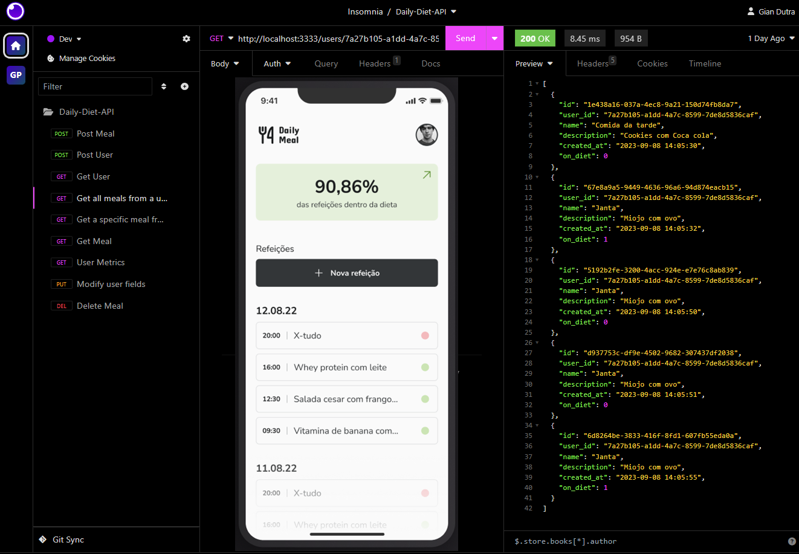

# Daily Diet API

<p align="center">
  

   <a href="https://github.com/YourUsername/MyMealsAPI/commits/master">
    
  </a>
  
</p>



> Project developed to register and manage user meals, with metrics functionalities and user authentication.

## About the project

The aim of this project is to allow users to record their meals, associating information such as name, description, date and time, and whether the meal is within or outside the diet. Additionally, the system offers functionalities to edit and delete meals, as well as metrics related to user's food intake.

### Functional Requirements

- [X] Should be able to create a user
- [X] Should be able to identify the user between requests
- [X] Should be able to register a meal, with the following information:
    - [X] Meals must be related to a user.
    - [X] Name
    - [X] Description
    - [X] Date and Time
    - [X] Is it within the diet or not
- [X] Should be able to edit a meal, being able to change all the above data
- [X] Should be able to delete a meal
- [X] Should be able to list all meals from a user
- [X] Should be able to view a single meal
- [X] Should be able to retrieve metrics for a user
    - [X] Total number of registered meals
    - [X] Total number of meals within the diet
    - [X] Total number of meals outside the diet
    - [X] Best sequence of meals within the diet
- [X] The user can only view, edit and delete meals they created

## Routes

### `GET - /meals`

Returns all meals created by the authenticated user.

### `GET - /meals/:id`

Returns the details of a specific meal, identified by its ID.

### `POST - /meals`

Creates a new meal associated with the authenticated user. Requires the following information in the request body:

- `name` - Meal name
- `description` - Detailed description of the meal
- `datetime` - Date and time of the meal (format: YYYY-MM-DDTHH:mm:ss)
- `is_diet` - Indicates whether the meal is within the diet or not (true/false)

### `PUT - /meals/:id`

Updates the details of a specific meal identified by its ID. Allows modification of:

- `name` - Meal name
- `description` - Detailed description of the meal
- `datetime` - Date and time of the meal (format: YYYY-MM-DDTHH:mm:ss)
- `is_diet` - Indicates whether the meal is within the diet or not (true/false)

### `DELETE - /meals/:id`

Removes a specific meal identified by its ID.

### `GET - /users`

Returns the list of all users.

### `POST - /users`

Creates a new user.

### `GET - /users/:id/meals`

Returns all meals associated with a specific user identified by their ID.

### `GET - /users/:id/metrics`

Returns food intake metrics for a specific user identified by their ID. Includes:

- Total number of registered meals
- Total number of meals within the diet
- Total number of meals outside the diet
- Best sequence of meals within the diet

## Technologies Used

- **[NodeJS](https://nodejs.org)**
- **[Fastify](https://github.com/fastify/fastify)**
- **[Fastify/cookie](https://github.com/fastify/fastify-cookie)**
- **[Knex](http://knexjs.org/)**
- **[Zod](https://github.com/colinhacks/zod)**
- **[Vitest](https://github.com/vitejs/vite)**
- **[Supertest](https://github.com/visionmedia/supertest)**
- **[Sqlite](https://github.com/sqlite/sqlite)**
- **[PostgreSQL](https://www.postgresql.org/)**

## 🚀 Testing MyMealsAPI

 
```bash

# Clone this repository
$ git clone git@github.com:YourUsername/MyMealsAPI.git

# Access the project folder in your terminal
$ cd MyMealsAPI

# Install the dependencies
$ npm install

# Run the application in developer mode
$ npm run dev

# Access the API
To test the routes and interact with the API, you can use a tool like Insomnia or Postman. Follow these steps:

1. Open Insomnia or Postman on your computer.

2. Create a new request for each API route you want to test (e.g., POST, GET, PUT, DELETE).

3. Set the request URL to http://localhost:3333, which is the default address where your API should be running.

4. Configure the request method and add any required headers or request body parameters according to the route you want to test.


## 👨‍💼 Author

<table>
  <tr>
    <td align="center">
      <a href="#">
        <br>
        <sub>
          <b>Gian Dutra</b>
        </sub>
      </a>
    </td>
  </tr>
</table>


